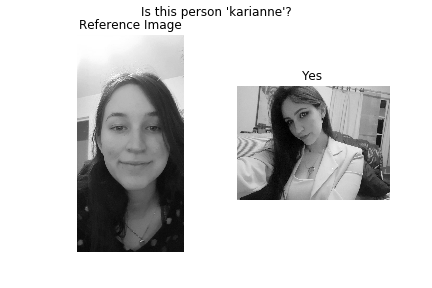

# Face-Verification
Face verification using Siamese Network Net structure 

# Description
Using a Siamese net it compares if an image is similar to another under a user-defined treshold.

# Image output

